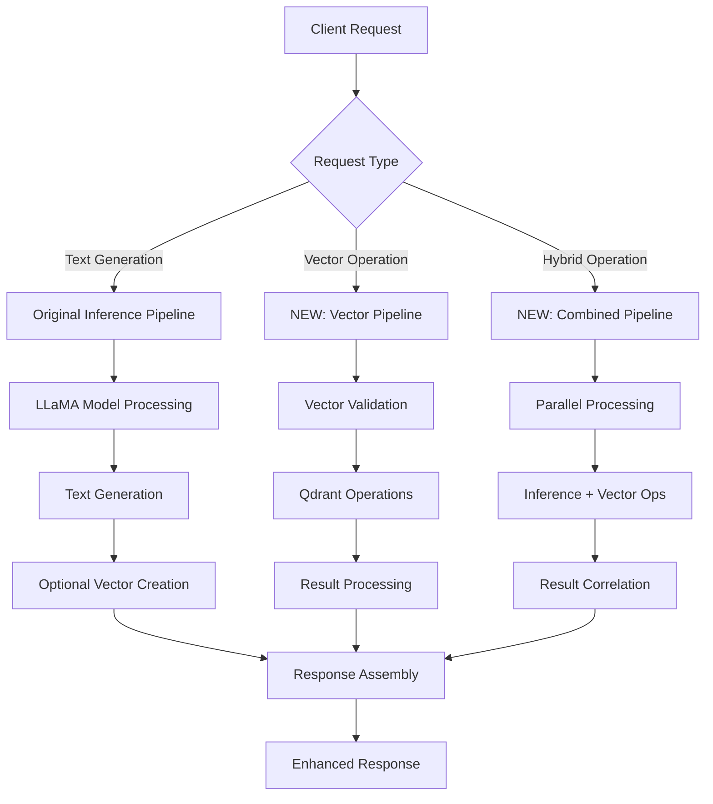

# 🏗️ **SYSTEM ARCHITECTURE CHANGES AFTER QDRANT INTEGRATION**

## 📋 **Overview**

The integration of Qdrant vector database will fundamentally transform your AI inference server from a **stateless inference-only system** to a **comprehensive AI platform** with persistent vector storage, semantic search capabilities, and advanced data management features.

---

## 🔄 **BEFORE vs AFTER SYSTEM ARCHITECTURE**

### **🔸 BEFORE: Current System (Inference-Only)**
```
┌─────────────────────────────────────────────────────────────┐
│                    AI INFERENCE SERVER                     │
├─────────────────────────────────────────────────────────────┤
│ ┌─────────────┐  ┌──────────────┐  ┌─────────────────────┐ │
│ │ HTTP API    │  │ Batch        │  │ Security           │ │
│ │ Endpoints   │  │ Processing   │  │ Middleware         │ │
│ └─────────────┘  └──────────────┘  └─────────────────────┘ │
│ ┌─────────────┐  ┌──────────────┐  ┌─────────────────────┐ │
│ │ Circuit     │  │ Failover     │  │ Health             │ │
│ │ Breaker     │  │ Manager      │  │ Monitoring         │ │
│ └─────────────┘  └──────────────┘  └─────────────────────┘ │
│ ┌─────────────────────────────────────────────────────────┐ │
│ │          LLAMA MODEL (TinyLlama)                        │ │
│ │          - Text Generation                              │ │
│ │          - Token Processing                             │ │
│ │          - Metal GPU Acceleration                       │ │
│ └─────────────────────────────────────────────────────────┘ │
└─────────────────────────────────────────────────────────────┘
        ▲                                           │
        │ HTTP Requests                             │ Generated Text
        │ (Stateless)                               ▼ Responses
   ┌─────────┐                                 ┌─────────┐
   │ Clients │                                 │ Clients │
   └─────────┘                                 └─────────┘
```

### **🔸 AFTER: Enhanced System (Inference + Vector Database)**
```
┌─────────────────────────────────────────────────────────────────────────────────┐
│                          ENHANCED AI INFERENCE PLATFORM                        │
├─────────────────────────────────────────────────────────────────────────────────┤
│ ┌─────────────────────────────────────────────────────────────────────────────┐ │
│ │                            API GATEWAY LAYER                               │ │
│ │ ┌─────────────┐ ┌─────────────┐ ┌─────────────┐ ┌─────────────────────────┐ │ │
│ │ │ Inference   │ │ Vector      │ │ Search      │ │ Collection              │ │ │
│ │ │ Endpoints   │ │ Storage     │ │ Endpoints   │ │ Management              │ │ │
│ │ │             │ │ Endpoints   │ │             │ │ Endpoints               │ │ │
│ │ └─────────────┘ └─────────────┘ └─────────────┘ └─────────────────────────┘ │ │
│ └─────────────────────────────────────────────────────────────────────────────┘ │
│ ┌─────────────────────────────────────────────────────────────────────────────┐ │
│ │                         ENHANCED MIDDLEWARE LAYER                          │ │
│ │ ┌─────────────┐ ┌─────────────┐ ┌─────────────┐ ┌─────────────────────────┐ │ │
│ │ │ Security    │ │ Rate        │ │ Circuit     │ │ Vector Request          │ │ │
│ │ │ + RBAC      │ │ Limiting    │ │ Breaker     │ │ Routing                 │ │ │
│ │ └─────────────┘ └─────────────┘ └─────────────┘ └─────────────────────────┘ │ │
│ └─────────────────────────────────────────────────────────────────────────────┘ │
│ ┌─────────────────────────────────────────────────────────────────────────────┐ │
│ │                        DUAL PROCESSING ENGINES                             │ │
│ │ ┌───────────────────────────────┐ ┌───────────────────────────────────────┐ │ │
│ │ │        INFERENCE ENGINE       │ │         VECTOR ENGINE                 │ │ │
│ │ │ ┌─────────────────────────────┐ │ │ ┌─────────────────────────────────┐ │ │ │
│ │ │ │    LLAMA MODEL              │ │ │ │    QDRANT CLIENT POOL          │ │ │ │
│ │ │ │    - Text Generation        │ │ │ │    - Connection Management     │ │ │ │
│ │ │ │    - Token Processing       │ │ │ │    - Retry Logic               │ │ │ │
│ │ │ │    - Metal GPU Acceleration │ │ │ │    - Health Monitoring         │ │ │ │
│ │ │ └─────────────────────────────┘ │ │ └─────────────────────────────────┘ │ │ │
│ │ │ ┌─────────────────────────────┐ │ │ ┌─────────────────────────────────┐ │ │ │
│ │ │ │    BATCH PROCESSING         │ │ │ │    VECTOR OPERATIONS            │ │ │ │
│ │ │ │    - Request Aggregation    │ │ │ │    - Bulk Insert/Update        │ │ │ │
│ │ │ │    - Failover Management    │ │ │ │    - Similarity Search          │ │ │ │
│ │ │ │    - Performance Optimization│ │ │ │    - Metadata Filtering        │ │ │ │
│ │ │ └─────────────────────────────┘ │ │ └─────────────────────────────────┘ │ │ │
│ │ │ ┌─────────────────────────────┐ │ │ ┌─────────────────────────────────┐ │ │ │
│ │ │ │    EMBEDDING GENERATION     │◄┼─┼►│    COLLECTION MANAGEMENT        │ │ │ │
│ │ │ │    - Auto Vector Creation   │ │ │ │    - Dynamic Schema             │ │ │ │
│ │ │ │    - Text to Vector         │ │ │ │    - Index Optimization         │ │ │ │
│ │ │ │    - Normalization          │ │ │ │    - Backup/Restore             │ │ │ │
│ │ │ └─────────────────────────────┘ │ │ └─────────────────────────────────┘ │ │ │
│ │ └───────────────────────────────────┘ └───────────────────────────────────────┘ │ │
│ └─────────────────────────────────────────────────────────────────────────────┘ │
│ ┌─────────────────────────────────────────────────────────────────────────────┐ │
│ │                    PERSISTENT STORAGE & EXTERNAL SYSTEMS                   │ │
│ │ ┌─────────────────────────────────────┐ ┌─────────────────────────────────┐ │ │
│ │ │           QDRANT CLUSTER            │ │        MONITORING STACK         │ │ │
│ │ │ ┌─────────────────────────────────┐ │ │ ┌─────────────────────────────┐ │ │ │
│ │ │ │ • Multiple Collections          │ │ │ │ • Prometheus Metrics        │ │ │ │
│ │ │ │ • HNSW Indexing                 │ │ │ │ • Grafana Dashboards        │ │ │ │
│ │ │ │ • Vector Similarity Search      │ │ │ │ • Vector Operation Metrics  │ │ │ │
│ │ │ │ • Metadata Storage              │ │ │ │ • Performance Tracking      │ │ │ │
│ │ │ │ • Backup/Snapshots              │ │ │ │ • Health Status Monitoring  │ │ │ │
│ │ │ └─────────────────────────────────┘ │ │ └─────────────────────────────┘ │ │ │
│ │ └─────────────────────────────────────┘ └─────────────────────────────────┘ │ │
│ └─────────────────────────────────────────────────────────────────────────────┘ │
└─────────────────────────────────────────────────────────────────────────────────┘
          ▲                                                           │
          │ Enhanced API Requests                                    │ Rich Response Data
          │ (Stateful + Stateless)                                   ▼ (Text + Vectors + Metadata)
     ┌─────────┐                                                 ┌─────────┐
     │ Clients │                                                 │ Clients │
     └─────────┘                                                 └─────────┘
```

---

## 🔄 **MAJOR SYSTEM CHANGES**

### **1. 🎯 ARCHITECTURAL TRANSFORMATION**

#### **From Stateless to Hybrid Architecture:**
- **Before**: Pure stateless inference (no data persistence)
- **After**: Hybrid system with stateful vector storage + stateless inference
- **Impact**: Enables knowledge retention, semantic search, and data-driven insights

#### **Service Layer Expansion:**
```rust
// BEFORE: Single inference service
struct InferenceServer {
    model: LlamaModel,
    batch_processor: BatchProcessor,
    health_monitor: HealthMonitor,
}

// AFTER: Multi-service architecture
struct AIInferencePlatform {
    // Original inference capabilities
    inference_engine: InferenceEngine,
    batch_processor: BatchProcessor,
    
    // NEW: Vector database integration
    vector_client: QdrantClient,
    vector_operations: VectorOperations,
    collection_manager: CollectionManager,
    
    // Enhanced components
    enhanced_health_monitor: EnhancedHealthMonitor,
    request_router: RequestRouter,
    embedding_processor: EmbeddingProcessor,
}
```

### **2. 📊 NEW API ENDPOINTS & CAPABILITIES**

#### **Original Endpoints (Enhanced):**
```rust
// Enhanced inference endpoints
POST /api/v1/generate           // Now with optional vector storage
POST /api/v1/generate/batch     // With vector batch operations
GET  /api/v1/health            // Enhanced with vector DB health
GET  /api/v1/metrics           // Combined inference + vector metrics
```

#### **NEW Vector Database Endpoints:**
```rust
// Vector storage operations
POST   /api/v1/vectors/insert           // Store vectors with metadata
POST   /api/v1/vectors/batch            // Bulk vector operations
PUT    /api/v1/vectors/{id}             // Update vector and metadata
DELETE /api/v1/vectors/{id}             // Delete vectors
GET    /api/v1/vectors/{id}             // Retrieve vector by ID

// Semantic search operations
POST   /api/v1/vectors/search           // Similarity search
POST   /api/v1/vectors/search/batch     // Multi-vector search
POST   /api/v1/vectors/recommend        // Recommendation engine
POST   /api/v1/vectors/cluster          // Vector clustering

// Collection management
POST   /api/v1/collections              // Create collections
GET    /api/v1/collections              // List collections
GET    /api/v1/collections/{name}       // Collection details
PUT    /api/v1/collections/{name}       // Update collection config
DELETE /api/v1/collections/{name}       // Delete collection
POST   /api/v1/collections/{name}/snapshot // Create snapshots

// Advanced analytics
GET    /api/v1/analytics/vectors        // Vector statistics
GET    /api/v1/analytics/search         // Search performance metrics
GET    /api/v1/analytics/usage          // Usage patterns and insights
```

### **3. 🔄 DATA FLOW TRANSFORMATION**

#### **Enhanced Request Processing Pipeline:**


#### **NEW: Automatic Embedding Pipeline:**
```rust
// Automatic vector generation from text inference
async fn enhanced_generate_text(request: GenerateRequest) -> EnhancedResponse {
    // 1. Original text generation
    let text_response = llama_model.generate(request.prompt).await?;
    
    // 2. NEW: Optional automatic embedding creation
    if request.store_embedding {
        let embedding = create_embedding(&request.prompt, &text_response).await?;
        let vector_point = VectorPoint::new(embedding, metadata);
        vector_ops.insert_vector(vector_point, Some("conversations")).await?;
    }
    
    // 3. Enhanced response with vector references
    EnhancedResponse {
        text: text_response,
        vector_id: vector_point.id,
        similarity_matches: None, // Optional related content
        metadata: enhanced_metadata,
    }
}
```

### **4. 🗄️ DATA PERSISTENCE & MANAGEMENT**

#### **NEW: Persistent Data Layer:**
```rust
// Data storage capabilities
struct DataManagement {
    // Vector storage
    embeddings: Collection<DocumentEmbedding>,
    conversations: Collection<ConversationHistory>,
    knowledge_base: Collection<KnowledgeEntry>,
    user_profiles: Collection<UserEmbedding>,
    
    // Metadata storage
    vector_metadata: HashMap<Uuid, DocumentMetadata>,
    search_history: Vec<SearchQuery>,
    analytics_data: AnalyticsStore,
}
```

#### **Collection Schemas:**
```rust
// Example collection configurations
let document_collection = CollectionConfig::for_embeddings("documents", 768)
    .with_payload_field("title", PayloadFieldType::Text)
    .with_payload_field("category", PayloadFieldType::Keyword)
    .with_payload_field("created_at", PayloadFieldType::Datetime)
    .with_payload_field("author", PayloadFieldType::Keyword);

let conversation_collection = CollectionConfig::for_embeddings("conversations", 384)
    .with_payload_field("user_id", PayloadFieldType::Keyword)
    .with_payload_field("session_id", PayloadFieldType::Keyword)
    .with_payload_field("intent", PayloadFieldType::Keyword)
    .with_payload_field("sentiment", PayloadFieldType::Float);
```

### **5. 🧠 ENHANCED AI CAPABILITIES**

#### **NEW: Semantic Understanding:**
```rust
// Semantic search and retrieval
impl SemanticEngine {
    // Find similar documents/conversations
    async fn find_similar_content(&self, query: &str) -> Vec<SimilarContent> {
        let query_embedding = self.create_embedding(query).await?;
        let search_params = SearchParams::new(query_embedding, 10)
            .with_score_threshold(0.7);
        self.vector_ops.search_vectors(search_params, Some("knowledge_base")).await?
    }
    
    // Contextual response generation
    async fn generate_contextual_response(&self, query: &str) -> ContextualResponse {
        // 1. Find relevant context
        let context = self.find_similar_content(query).await?;
        
        // 2. Enhanced prompt with context
        let enhanced_prompt = format!("Context: {}\nQuery: {}", context, query);
        
        // 3. Generate informed response
        let response = self.llama_model.generate(enhanced_prompt).await?;
        
        ContextualResponse {
            response,
            context_sources: context,
            confidence_score: calculate_confidence(&context, &response),
        }
    }
}
```

#### **NEW: Knowledge Management:**
```rust
// Dynamic knowledge base
impl KnowledgeManager {
    // Learn from interactions
    async fn learn_from_interaction(&self, query: &str, response: &str, feedback: f32) {
        let interaction_embedding = self.create_interaction_embedding(query, response).await?;
        let metadata = hashmap! {
            "query" => json!(query),
            "response" => json!(response),
            "feedback_score" => json!(feedback),
            "timestamp" => json!(chrono::Utc::now()),
        };
        
        self.vector_ops.insert_vector(
            VectorPoint::new(interaction_embedding, metadata),
            Some("learning_data")
        ).await?;
    }
    
    // Improve responses over time
    async fn get_improved_response(&self, query: &str) -> ImprovedResponse {
        // Find similar successful interactions
        let similar_interactions = self.find_similar_interactions(query).await?;
        
        // Weight by feedback scores
        let best_practices = self.extract_best_practices(similar_interactions).await?;
        
        // Generate improved response
        self.generate_with_best_practices(query, best_practices).await?
    }
}
```

### **6. 📈 MONITORING & ANALYTICS ENHANCEMENT**

#### **Expanded Metrics Collection:**
```rust
// Enhanced metrics structure
struct EnhancedMetrics {
    // Original inference metrics
    inference_metrics: InferenceMetrics,
    
    // NEW: Vector operation metrics
    vector_insert_rate: Counter,
    vector_search_latency: Histogram,
    vector_storage_usage: Gauge,
    collection_sizes: HashMap<String, Gauge>,
    
    // NEW: Search analytics
    search_patterns: SearchAnalytics,
    popular_queries: QueryPopularity,
    user_behavior: UserBehaviorMetrics,
    
    // NEW: System integration metrics
    qdrant_connection_pool: PoolMetrics,
    qdrant_health_status: HealthMetrics,
    cross_service_latency: Histogram,
}
```

#### **Analytics Dashboards:**
```yaml
# NEW Grafana Dashboards
Vector Database Operations:
  - Vector insertion throughput (vectors/sec)
  - Search latency distribution (P50, P95, P99)
  - Collection growth over time
  - Storage utilization and efficiency
  
Semantic Search Analytics:
  - Query patterns and frequency
  - Search accuracy and relevance scores
  - Popular content and trending topics
  - User interaction patterns
  
System Integration Health:
  - Cross-service communication latency
  - Connection pool utilization
  - Error rates by operation type
  - Resource usage correlation
```

### **7. 🔐 ENHANCED SECURITY & ACCESS CONTROL**

#### **Extended RBAC System:**
```rust
// Enhanced security model
enum Permission {
    // Original permissions
    GenerateText,
    HealthCheck,
    ViewMetrics,
    
    // NEW: Vector permissions
    InsertVectors,
    SearchVectors,
    UpdateVectors,
    DeleteVectors,
    ManageCollections,
    CreateSnapshots,
    ViewAnalytics,
    AdministerSystem,
}

// Role-based access for vector operations
impl SecurityMiddleware {
    async fn authorize_vector_operation(&self, user: &User, operation: VectorOperation) -> bool {
        match operation {
            VectorOperation::Insert => user.has_permission(Permission::InsertVectors),
            VectorOperation::Search => user.has_permission(Permission::SearchVectors),
            VectorOperation::ManageCollections => user.has_permission(Permission::ManageCollections),
            VectorOperation::AdminAccess => user.has_permission(Permission::AdministerSystem),
        }
    }
}
```

### **8. 🚀 DEPLOYMENT & INFRASTRUCTURE CHANGES**

#### **Container Architecture Expansion:**
```yaml
# Docker Compose - Development
services:
  ai-inference-server:    # Enhanced with vector capabilities
  qdrant:                 # NEW: Vector database
  qdrant-ui:             # NEW: Management interface
  prometheus:            # Enhanced metrics collection
  grafana:               # Extended dashboards
  redis:                 # NEW: Caching layer (optional)
```

#### **Kubernetes Production Deployment:**
```yaml
# Production Kubernetes Architecture
namespaces:
  - ai-inference-system  # Original namespace (enhanced)
  - qdrant-system       # NEW: Vector database namespace
  - monitoring          # Enhanced monitoring stack

services:
  - ai-inference-server (3 replicas)
  - qdrant-cluster (3 replicas)        # NEW
  - qdrant-load-balancer               # NEW
  - vector-operation-workers (5 replicas) # NEW
  - enhanced-monitoring-stack          # Enhanced
```

---

## 🎯 **BUSINESS IMPACT & NEW USE CASES**

### **🆕 Enabled Use Cases:**

1. **📚 Knowledge Base & RAG (Retrieval-Augmented Generation):**
   - Store and retrieve contextual information
   - Generate informed responses based on stored knowledge
   - Continuous learning from user interactions

2. **🔍 Semantic Search & Discovery:**
   - Find similar documents, conversations, or content
   - Content recommendation systems
   - Intelligent data exploration

3. **👤 Personalization & User Profiles:**
   - Store user interaction patterns as vectors
   - Personalized response generation
   - Adaptive AI behavior based on user preferences

4. **📊 Content Analytics & Insights:**
   - Analyze conversation patterns and trends
   - Identify popular topics and user needs
   - Content performance optimization

5. **🧪 A/B Testing & Experimentation:**
   - Store multiple response variations
   - Measure effectiveness through vector similarity
   - Optimize AI responses based on user feedback

### **💼 Business Value:**

1. **📈 Enhanced User Experience:**
   - More contextual and relevant responses
   - Personalized AI interactions
   - Faster access to relevant information

2. **💰 Revenue Opportunities:**
   - Premium semantic search features
   - Analytics and insights as a service
   - Enhanced API capabilities for enterprise customers

3. **🎯 Competitive Advantages:**
   - State-of-the-art vector database integration
   - Scalable semantic search capabilities
   - Advanced AI platform vs. simple inference server

4. **📊 Data-Driven Insights:**
   - Understanding user behavior and preferences
   - Content optimization opportunities
   - Performance improvement identification

---

## 🔮 **MIGRATION STRATEGY & TIMELINE**

### **Phase 1: Foundation (Weeks 1-2)**
- ✅ Qdrant infrastructure deployment
- ✅ Basic vector operations integration
- ✅ Enhanced health monitoring

### **Phase 2: Core Features (Weeks 3-4)**
- 🔄 API endpoint expansion
- 🔄 Automatic embedding generation
- 🔄 Basic semantic search

### **Phase 3: Advanced Features (Weeks 5-6)**
- 📋 Collection management UI
- 📋 Analytics and reporting
- 📋 Performance optimization

### **Phase 4: Production Readiness (Weeks 7-8)**
- 📋 Comprehensive testing
- 📋 Security hardening
- 📋 Documentation and training

---

## 🎯 **CONCLUSION**

The Qdrant integration transforms your AI inference server from a **simple text generation service** into a **comprehensive AI platform** with:

- **🧠 Enhanced Intelligence**: Contextual understanding and semantic capabilities
- **💾 Persistent Memory**: Long-term knowledge storage and retrieval
- **🔍 Advanced Search**: Vector similarity and semantic search
- **📊 Rich Analytics**: Deep insights into usage patterns and performance
- **🚀 Scalability**: Production-ready architecture for enterprise deployment
- **🎯 New Revenue Streams**: Premium features and enterprise capabilities

This evolution positions your system as a **modern AI platform** capable of competing with state-of-the-art solutions while maintaining the performance and reliability of your current inference capabilities.