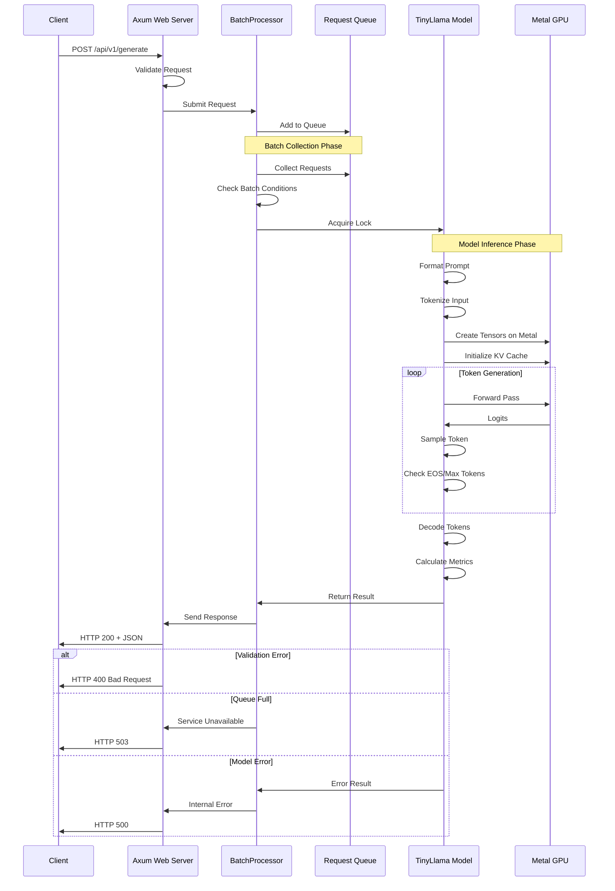
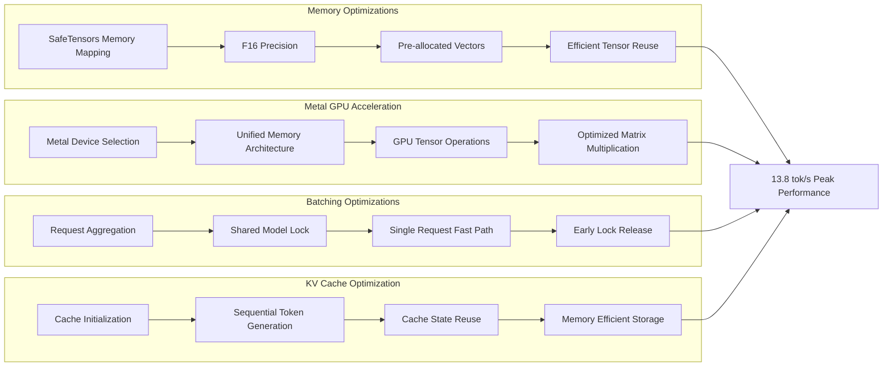
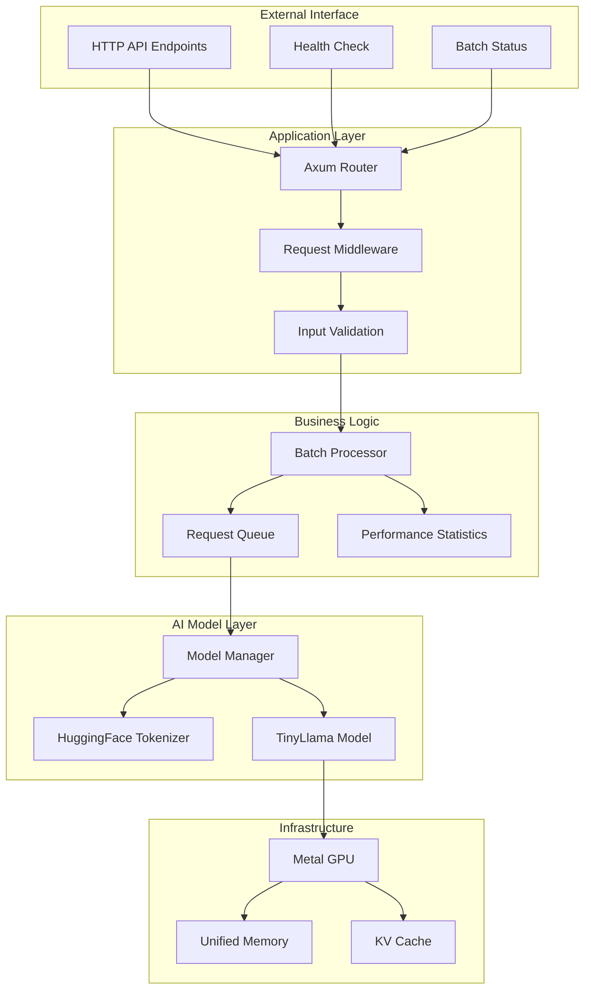
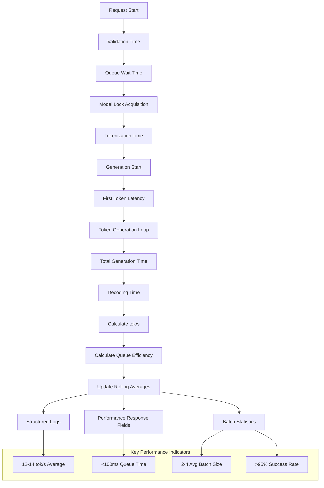
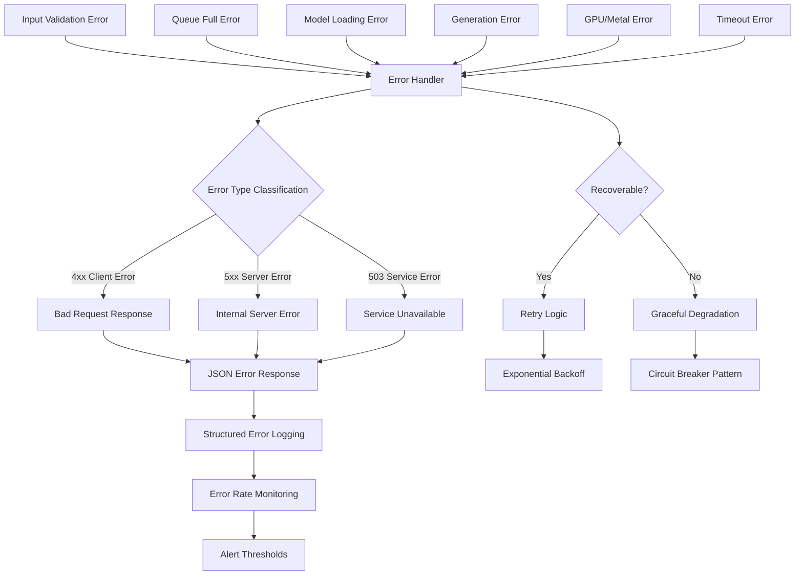

# AI Inference Server - Detailed System Flow Diagram

## 🌊 Complete Request Processing Flow

```mermaid
graph TD
    %% Client Request Entry
    A[Client HTTP Request] -->|POST /api/v1/generate| B[Axum Web Server]
    
    %% Request Validation & Processing
    B --> C{Request Validation}
    C -->|Invalid| D[Return 400 Error]
    C -->|Valid| E[Generate Request ID]
    
    %% Batch Processing Decision
    E --> F[Submit to BatchProcessor]
    F --> G{Queue Status Check}
    G -->|Queue Full| H[Return 503 Service Unavailable]
    G -->|Queue Available| I[Add to Request Queue]
    
    %% Batch Collection Strategy
    I --> J[Batch Collection Loop]
    J --> K{Batch Conditions}
    K -->|Max Size Reached<br/>OR Max Wait Time| L[Process Batch]
    K -->|Continue Waiting| M[Wait 5ms]
    M --> K
    
    %% Model Processing Path
    L --> N{Batch Size = 1?}
    N -->|Yes| O[Single Request Fast Path]
    N -->|No| P[Multi-Request Batch Path]
    
    %% Single Request Processing
    O --> Q[Acquire Model Lock]
    Q --> R[Model Generate Call]
    R --> S[Release Model Lock Early]
    S --> T[Send Response]
    
    %% Batch Request Processing
    P --> U[Acquire Model Lock]
    U --> V[Process All Requests Sequentially]
    V --> W[Release Model Lock]
    W --> X[Send All Responses]
    
    %% Model Generation Deep Dive
    R --> AA[Format Chat Prompt]
    V --> AA
    AA --> BB[Tokenize Input]
    BB --> CC[Create Input Tensor]
    CC --> DD[Initialize KV Cache]
    DD --> EE[First Forward Pass - Full Prompt]
    
    %% Token Generation Loop
    EE --> FF[Extract First Token]
    FF --> GG{Generation Loop}
    GG -->|Continue| HH[Create Single Token Tensor]
    HH --> II[Forward Pass with Cache]
    II --> JJ[Sample Next Token]
    JJ --> KK{EOS Token OR Max Tokens?}
    KK -->|No| GG
    KK -->|Yes| LL[Decode Tokens to Text]
    
    %% Performance Monitoring
    LL --> MM[Calculate Performance Metrics]
    MM --> NN[Log Performance Stats]
    NN --> T
    NN --> X
    
    %% Response Construction
    T --> OO[Build JSON Response]
    X --> OO
    OO --> PP[Return HTTP 200]
    
    %% Error Handling Paths
    Q -->|Lock Failed| QQ[Handle Lock Error]
    U -->|Lock Failed| QQ
    AA -->|Tokenization Failed| RR[Handle Token Error]
    EE -->|Model Error| SS[Handle Model Error]
    II -->|Forward Pass Error| SS
    
    QQ --> TT[Return 500 Error]
    RR --> TT
    SS --> TT
    
    %% Background Processes
    subgraph "Background Tasks"
        YY[Batch Processing Loop]
        ZZ[Statistics Updates]
        AAA[Health Check Monitoring]
    end
    
    %% Styling
    classDef clientRequest fill:#e1f5fe
    classDef validation fill:#f3e5f5
    classDef batchProcess fill:#e8f5e8
    classDef modelProcess fill:#fff3e0
    classDef errorHandle fill:#ffebee
    classDef response fill:#f1f8e9
    
    class A clientRequest
    class C,E validation
    class F,G,I,J,K,L,N batchProcess
    class Q,R,AA,BB,CC,DD,EE,FF,GG,HH,II,JJ,KK,LL,MM modelProcess
    class D,H,QQ,RR,SS,TT errorHandle
    class OO,PP,T,X response
```

## 🔄 Detailed Component Interactions

## ⚡ Performance Optimization Flow

## 🔧 System Architecture Overview

## 📊 Performance Metrics Flow

## 🚦 Error Handling Flow

---

## 📋 Flow Diagram Legend

- **🔵 Blue Nodes**: Client interactions and external interfaces
- **🟢 Green Nodes**: Successful processing paths
- **🟡 Yellow Nodes**: Decision points and conditionals  
- **🔴 Red Nodes**: Error conditions and handling
- **⚪ Gray Nodes**: Background processes and monitoring

## 🎯 Key Optimization Points

1. **Batch Collection Strategy**: Dynamic batching based on load
2. **Metal GPU Utilization**: Unified memory architecture benefits
3. **KV Cache Management**: Efficient attention state reuse
4. **Memory Allocation**: Pre-allocation and tensor reuse patterns
5. **Lock Management**: Early release for better concurrency